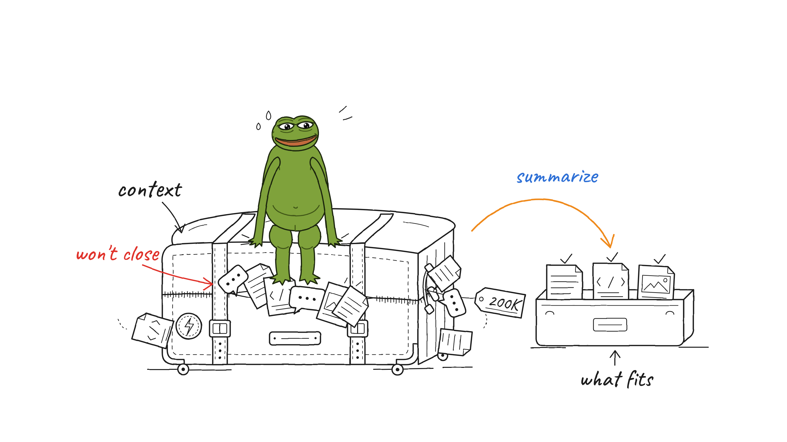

# Pepe Illustrations

Hand-drawn, slightly absurd 16:9 explainer pictures starring Pepe the frog, for articles, posts, docs and "how does this work" explanations. Packaged as a Claude skill.

Adapted from **[Ian Xiaohei Illustrations](https://github.com/helloianneo/ian-xiaohei-illustrations)** by Ian. The original Chinese README is kept in [`README.original.zh.md`](README.original.zh.md). See [`NOTICE.md`](NOTICE.md).



## What changed from the original

- **Pepe replaces 小黑** (the black blob) as the recurring character. The canonical drawing is [`pepe-illustrations/assets/pepe/pepe.svg`](pepe-illustrations/assets/pepe/pepe.svg).
- **Claude draws the pictures itself** as detailed SVG, renders them to PNG, looks at the result and revises. Image-generation tools (Canva, `image_gen`, etc.) are a fallback only.
- **A hard detail floor** keeps the drawings at the level of the original artist's examples: built props, contents with marks, reposed character, story details, and at least two render-review rounds. `scripts/render.mjs` checks the shape count and palette.
- Instructions are in English. Labels follow the language of the source material, using the bundled Caveat (Latin) and Ma Shan Zheng (Chinese) handwriting fonts.

## Install

Copy the skill folder into your Claude skills directory and install the renderer's one dependency:

```bash
cp -R pepe-illustrations ~/.claude/skills/
cd ~/.claude/skills/pepe-illustrations && npm install
# if Playwright has no browser yet:
npx playwright install chromium
```

## Use

```text
Use the pepe-illustrations skill to plan 4 pictures for this article, then draw them.
Draw a Pepe explainer of how a context window fills up.
Shot list only for now. Don't draw yet.
```

Each picture is saved as both SVG (editable) and PNG under `assets/<article-slug>-illustrations/`.

## Layout

```text
pepe-illustrations/
├── SKILL.md                     # workflow and the quality bar
├── package.json                 # playwright, for the renderer
├── scripts/render.mjs           # SVG -> PNG + detail check
├── references/
│   ├── svg-drawing-guide.md     # canvas, pen, palette, detail floor, techniques
│   ├── pepe-ip.md               # Pepe's look, personality, reposing
│   ├── style-dna.md
│   ├── composition-patterns.md
│   ├── qa-checklist.md
│   └── prompt-template.md       # fallback image-generation prompts
└── assets/
    ├── pepe/                    # base Pepe asset (SVG + PNG)
    ├── svg-examples/            # worked SVG example at full detail
    ├── examples/                # original artist's raster examples (style calibration)
    └── fonts/                   # Caveat + Ma Shan Zheng (OFL)
```
